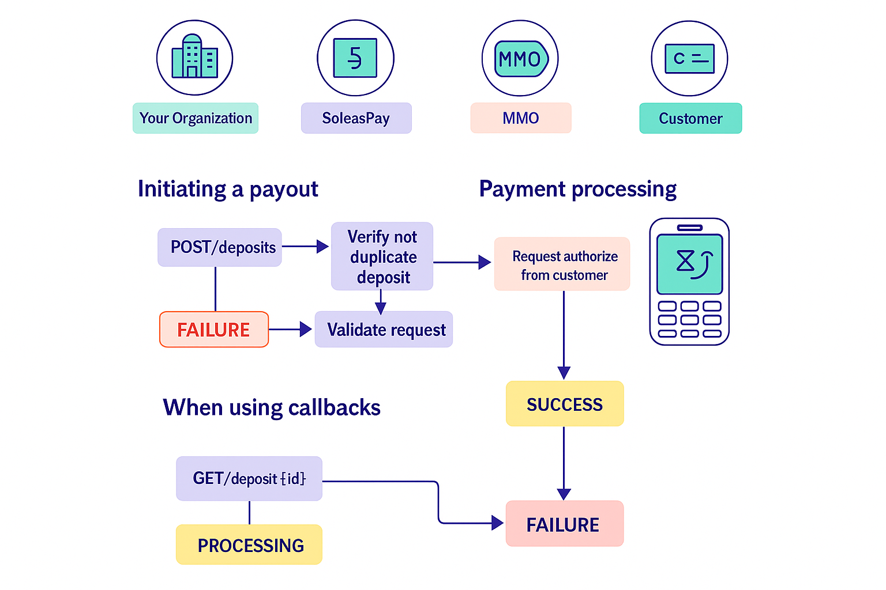

You can request a payment from a customer. Funds will be moved from the customer’s **mobile money wallet** to your **account** on [SOLEASPAY](https://soleaspay.com).

This operation **must be explicitly authorized by the customer**, who will enter their **PIN code** on their mobile phone.

The operation may take anywhere from a few seconds up to a few minutes to complete.

---
<Note>
  Please follow the guidelines in the Implementation section of our API docs to ensure a reliable implementation.
</Note>
## 🔁 Deposit Flow

1. You send a **deposit request** to SoleasPay.
2. SoleasPay forwards the request to the **Mobile Money Operator (MMO)** you specify.
3. The MMO sends a **payment authorization prompt** to the customer's phone.
4. The customer enters their **PIN** to approve the transaction.
5. The MMO returns a **success or failure** status to SoleasPay.
6. SoleasPay notifies you via:
   - A **callback** to your configured URL (if set), or
   - You can **poll the Check Deposit Status endpoint** manually.

---

## 🔔 Callback Notification

If you’ve configured a **callback URL**, SoleasPay will automatically notify your system of the transaction result using a **Deposit Status Callback**.

> If no callback is configured, you can still track the request manually using the `Check Deposit Status` API endpoint.

---

## 📌 Deposit Status Lifecycle
Once your deposit request is accepted for processing, it can go through the following statuses:

| Status      | Description                                                                  |
|-------------|------------------------------------------------------------------------------|
| `PROCESSING`  | The payout request has been accepted by SoleasPay for processing.          |
| `SUCCESS` | The payout was successful. ✅ **Final State**                                 |
| `FAILLURE`    | The payout failed. ❌ **Final State**                                     |

---

## ⚙️ Implementation Note

For a reliable integration:
- Follow all guidelines in the **Implementation section** of the API documentation.
- Ensure your backend handles **webhooks** correctly if using callbacks.
- Handle **all status transitions** gracefully in your UI/UX and logic.

For more details visite  [deposite api-reference](https://doc.soleaspay.com/api-reference/endpoint/collectionPayment). 