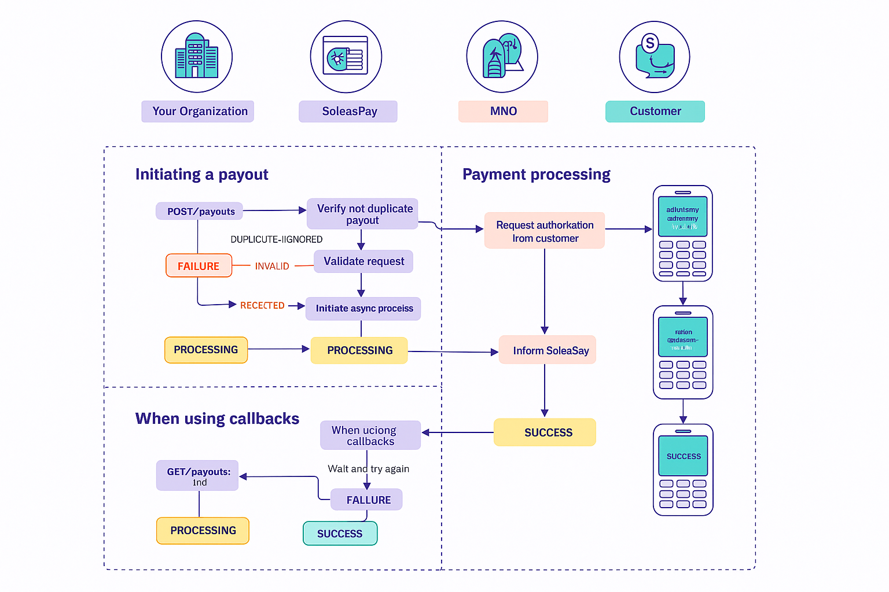

##  Refund

You can make refund for any transaction from your **SoleasPay account** to its **sender’s mobile money wallet**.

✅ This operation **does not require customer PIN authorization** and is usually processed within **seconds**.

---

## 🔁 Refund Flow

1. You submit a **refund request** to SoleasPay.
2. SoleasPay processes the transaction.
3. SoleasPay forwards the request to the **Mobile Money Operator (MMO)**.
4. The MMO processes the transaction and informs SoleasPay.
5. SoleasPay notifies your backend via:
   - A **callback URL** (if configured), and
   - The payer through email 
   
   you can **manually check** the refund status using the `Check Status` endpoint.

---

## 🔔 Callback Notification

If you’ve configured a **callback URL**, SoleasPay will notify you of the final transaction status using a **Payout Status Callback**.

> If not, use the **Check Payout Status endpoint** to poll the status.

---

## 📌 Refund Status Lifecycle

After your refund request is submitted, it may transition through the following statuses:

| Status      | Description                                                                  |
|-------------|------------------------------------------------------------------------------|
| `PROCESSING`  | The refund request has been accepted by SoleasPay for processing.              |
| `SUCCESS` | The refund was successful. ✅ **Final State**                                 |
| `FAILLURE`    | The refund failed. ❌ **Final State**                                          |

---

---
## 📦 Enqueued Refunds

When an **MMO is temporarily unavailable or experiencing issues**, payouts may not be processed immediately.

In these cases:

- The refund is still **accepted by SoleasPay**, but marked as `PROCESSING`.
- The request is **automatically processed later** when the MMO is back online.

### 🛑 Cancelling Enqueued Refunds

You can cancel an enqueued refunds if it hasn't yet been submitted:

- Use the `Cancel Enqueued Payout` API endpoint.
- Or cancel directly from the **SoleasPay Dashboard**.

---

## 📡 MMO Availability

Our Payment Operations team monitors MMO availability **24/7**. You can:

- View the **real-time status** on the [SoleasPay Status Page](https://soleaspay.com)
- Access MMO stability programmatically via the **Availability Endpoint**

> Use this to avoid initiating payouts during MMO downtime.

---

## ⚙️ Implementation Tip

Ensure your integration:
- Handles all **status transitions** appropriately.
- Supports **callback or polling** to track payout status.
- Implements retry or cancellation logic for `ENQUEUED` payouts.

For more details visite  [payout api-reference](https://doc.soleaspay.com/api-reference/endpoint/disbursement). 
