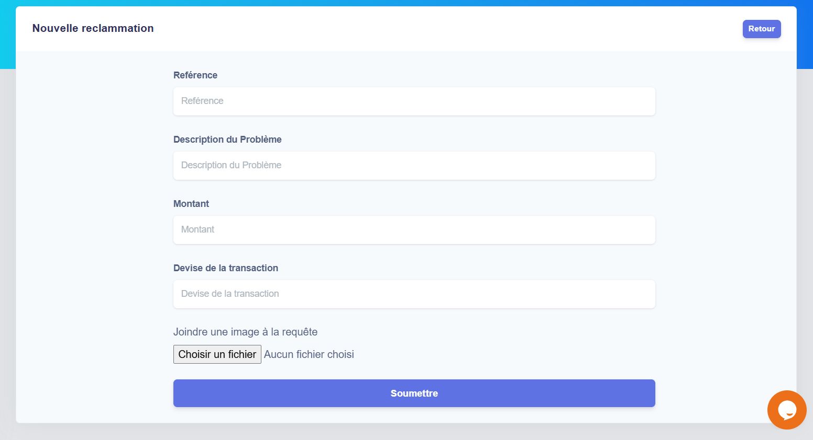

<Tip>
  For easy reconciliation and auditability, you can always see detailed financial statements of your wallets.
  Every single transaction affecting your balance is recorded on the statement.
</Tip>

## Reclaim a transaction
Pressing on "Signale a problem"will help you to relaim a transaction 

used this form to reclaim a transaction that you have maked.
