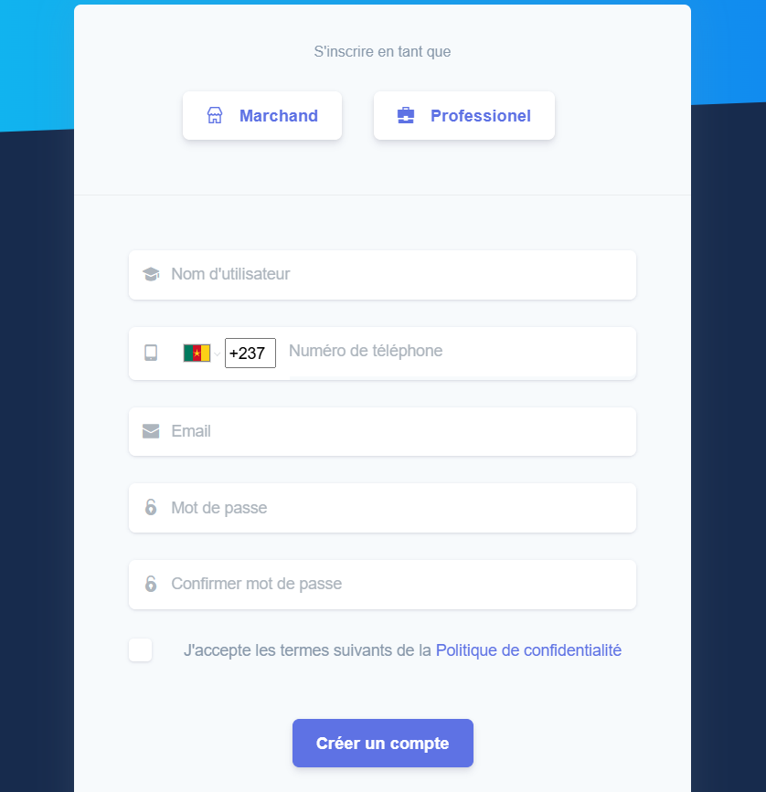
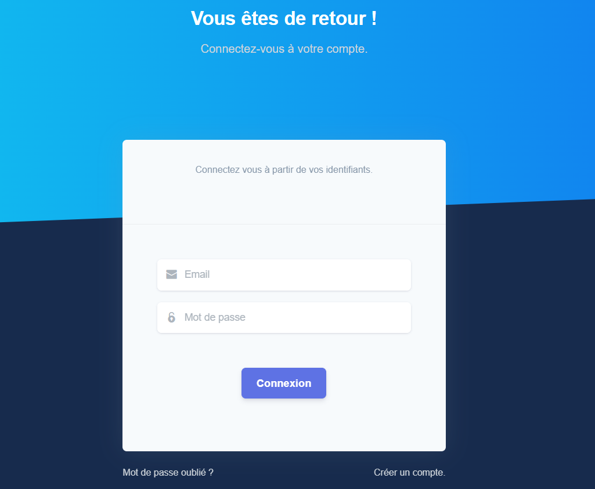

The SoleasPay dashboard supports one methods of user authentication: traditional password-based authentication.

## Creating your account

Creation of an account in SoleasPay you need to Choose either Professional or Marchant and then fills 
the forms 

Pressing "Create Account" will take you to our Dashboard[sign-in page](https://app.soleaspay.com/auth/register).

---

## Signing into the dashboard

## Authentication with username and password

Go to our [sign-in page](https://app.soleaspay.com/auth/login), enter your email address, and press “Connexion”.

---
