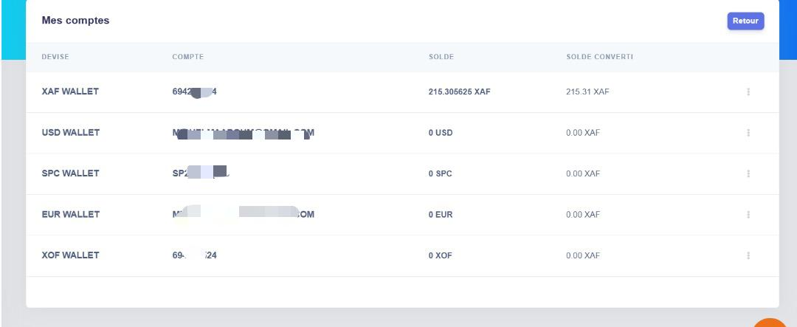

<Tip>
 On the SoleasPay platform, all of your mobile money is stored in wallets. In most cases, wallets 
 are issued per country and hold all your available mobile money in that country.

On the Wallets page, you can see running balances of all your wallets and also have an option to 
choose a breakdown of those wallets to see what kind of transactions have occurred.
</Tip>

## Balance overview

In the balance overview section of the page, you can see each of your wallets and their:

1. Currency
2. Account
3. Balance
4. Convert Balance
